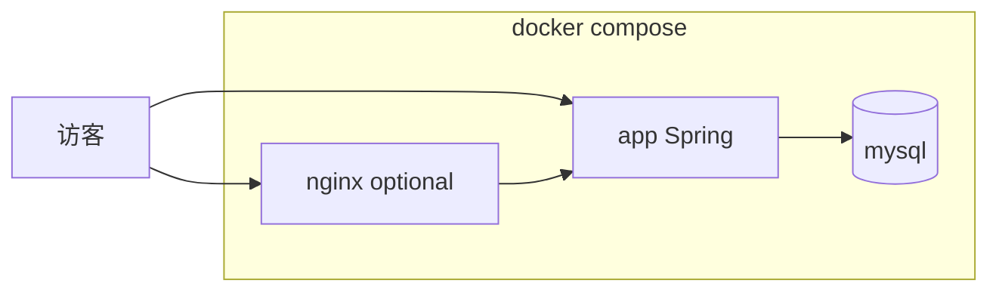

# Docker 云部署指南

本文说明如何在云服务器上用 **Docker Compose** 运行挚友树洞（Spring Boot + MySQL），可选 **Nginx** 反代与 **Vue SPA** 同域部署。

## 对外形态（二选一）

| 模式 | 说明 | 命令要点 |
|------|------|----------|
| **A. Thymeleaf 主站（推荐默认）** | 访客使用 Spring 渲染的页面；可直接访问容器 `8080` 或加 Nginx 反代整站 | `docker compose up -d` 或加 `--profile nginx` |
| **B. Vue SPA（web）** | 先 `web` 目录 `npm run build`，再用独立服务 **`nginx-vue`** 托管 `dist`，`/api` 与 `/uploads` 反代到 Spring | `docker compose --profile nginx-vue up -d --build` |

详细步骤见下文「Vue 前端（可选）」。



## 前置要求

- 已安装 **Docker Engine** 与 **Docker Compose v2**
- 服务器防火墙放行端口：**8080**（直连应用）或 **80/443**（走 Nginx）
- 构建建议在 **Linux / WSL / CI** 或**英文路径**下进行，避免 Windows 中文路径下的 Maven 异常（与 [Dockerfile](../Dockerfile) 注释一致）

## 快速启动（MySQL + Spring）

1. 在仓库根目录复制环境变量模板：

   ```bash
   cp .env.example .env
   ```

   编辑 `.env`，设置强密码：`MYSQL_ROOT_PASSWORD`、`MYSQL_PASSWORD`。

2. 创建上传目录（挂载用，可为空）：

   ```bash
   mkdir -p uploads/starlight
   ```

3. 构建并启动：

   ```bash
   docker compose up -d --build
   ```

4. 验证：

   - 浏览器访问 `http://服务器IP:8080/`（端口与 `.env` 中 `APP_PORT` 一致）
   - 健康检查：`curl -s http://127.0.0.1:8080/actuator/health`

首次启动时，JPA 会在 MySQL 中 **`ddl-auto=update`** 建表（与 [`docker-compose.yml`](../docker-compose.yml) 中环境变量一致）。表结构稳定后建议改为 `validate` 并引入 Flyway（见 [mysql-migration-plan.md](mysql-migration-plan.md)）。

## Nginx 反代（profile `nginx`）

在 80 端口对外提供服务，由 Nginx 将流量转发到 `app:8080`（配置见 [`deploy/nginx/thymeleaf.conf`](../deploy/nginx/thymeleaf.conf)）：

```bash
docker compose --profile nginx up -d --build
```

`.env` 中可通过 `HTTP_PORT` 修改宿主机映射端口（默认 80）。

## Vue 前端（可选）

1. 构建静态资源：

   ```bash
   cd web
   npm ci
   npm run build
   cd ..
   ```

2. 使用 Compose 中的 **`nginx-vue`** 服务（与 `nginx` 二选一，勿同时启用同一 `HTTP_PORT`）：

   ```bash
   docker compose --profile nginx-vue up -d --build
   ```

3. 与开发环境一致：前端使用相对路径请求 `/api`、`/uploads` 时，**无需改 `VITE_API_BASE`**（见 [`web/.env.production.example`](../web/.env.production.example)）。若 API 在异域，再设置 `VITE_API_BASE` 并调整 Nginx。

Nginx 配置参考 [`deploy/nginx/vue-spa.conf`](../deploy/nginx/vue-spa.conf)。

## 环境变量说明

| 变量 | 作用 |
|------|------|
| `MYSQL_ROOT_PASSWORD` | MySQL root |
| `MYSQL_PASSWORD` | 应用用户 `hollow` 的密码 |
| `APP_PORT` | 宿主机映射到容器的 **8080**（不设 `nginx` 时） |
| `HTTP_PORT` | 宿主机映射到 Nginx 的 **80**（`nginx` profile） |

应用容器内还通过环境变量注入 **Spring DataSource** 与 **`APP_STARLIGHT_UPLOAD_DIR=/app/uploads/starlight`**，与卷 `./uploads:/app/uploads` 对应。

## 数据持久化与备份

- **MySQL 数据**：Compose 卷 **`mysql_data`**（勿随意删除）
- **上传图片**：宿主机目录 **`./uploads`**（需备份）

备份示例：

```bash
docker compose exec mysql mysqldump -uhollow -p"$MYSQL_PASSWORD" hollow > backup-hollow.sql
tar czf uploads-backup.tgz uploads
```

## 更新应用版本

```bash
git pull
docker compose build --no-cache app
docker compose up -d
```

数据库结构变更请配合迁移脚本或手工 SQL，勿依赖 `update` 长期自动改表。

## HTTPS 与域名

Compose 内未内置证书。常见做法：

- 宿主机再装 **Nginx + certbot**，反代到 `127.0.0.1:80` 或 `127.0.0.1:8080`
- 或使用云厂商 **负载均衡 / CDN** 终止 TLS

## 安全提示

- 不要将含真实密码的 `.env` 提交到公开仓库
- 当前 Spring Security 为全站匿名可访问；公网暴露前请自行评估是否需要鉴权或管理面限制

## 相关文件

- [`Dockerfile`](../Dockerfile)
- [`docker-compose.yml`](../docker-compose.yml)
- [`.env.example`](../.env.example)
- [`application-docker.properties`](../src/main/resources/application-docker.properties)
- [MySQL 迁移说明](mysql-migration-plan.md)
